# Como utilizar o cache do Datapower

## Introdução 

### O IBM Datapower Gateway é uma solução já consolidada no quesito de segurança, transformação e integração, além disso ele é bastante robusto e devido a sua arquitetura consegue atender muitas requisições por segundo e  com o Datapower é possível fazer cache de resposta do backend, aumentando ainda mais a carga do seu sistema, pois ele mesmo irá se responsabilizar por retornar ao cliente a resposta que já foi consultada anteriormente.

<br/>

### Existem 2 formas para utilizar o serviço de cache do IBM Datapower Gateway, mas antes de falarmos sobre estas formas, precisamos detalhar como é o funcionamento.

<br/>

### O cache do Datapower é para request/response, portanto se você fizer uma requisição para uma API passando um parâmetro e em seguida fizer uma nova requisição com o mesmo parâmetro o Datapower não irá no backend, irá retornar o valor que está em cache na memória.

#### Fazendo a primeira chamada:
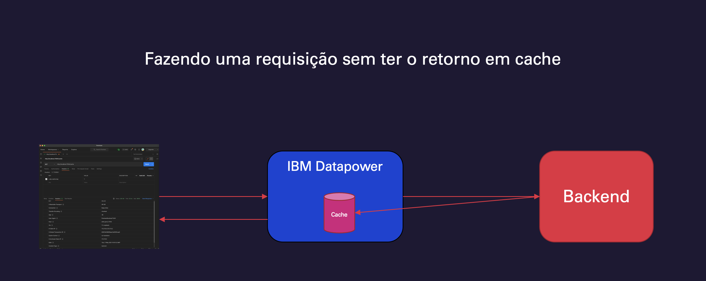 

#### Fazendo a segunda chamada(dentro do TTL):
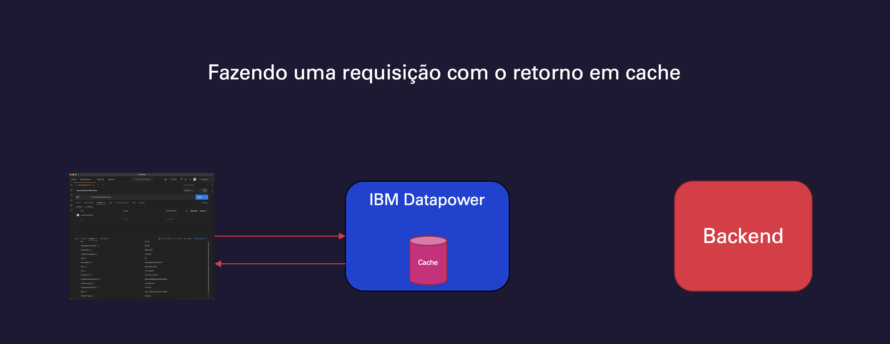 

### A segunda chamada em diante será respondida diretamente do Datapower para o client, até que o cache expire(configurado no TTL).

---
## Formas de armazenamento em cache

### Existem 2 formas de armazenar a informação no cache:

1. Utilizar a memória do próprio Datapower para armazenar a informação
2. Utilizar o WebSphere eXtreme Scale(WXS)

### **Agora vamos para as considerações, que são decisivas para a melhor utilização da solução:**

1. Utilizando cache na memória do Datapower, ao utilizar este modo, devemos ter as seguintes preocupações:
    -  A memória do Datapower é limitada e compartilhada, portanto, caso você tenha muitos objetos em memória e pesados, poderá comprometer o funcionamento de toda a solução
    - Caso você esteja trabalhando com 2 ou mais Datapower em cluster, ele irá fazer cache **sem** compartilhamento.
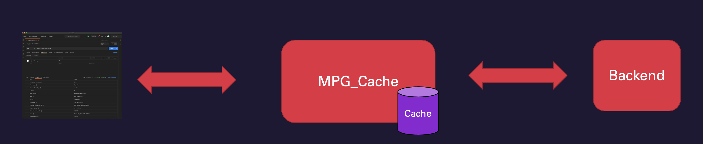 

2. Utilizando cache com o WXS do Datapower, ao utilizar este modo, devemos ter as seguintes preocupações:
    -  Neste modo o Datapower será apenas uma client, ele irá fazer todo o armazenamento de memória por fora, delegando ao WXS a responsabilidade de cache.
    - Desta forma, é possível fazer compartilhamento cache entre 2 ou mais Datapower que estiverem trabalhando juntos.
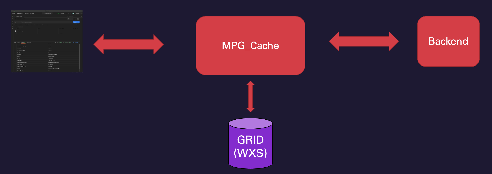

---

## Como fazer cache com Datapower

###  Independente se o cache for externo(via WXS), ou interno(na memória), o procedimento para criação é o mesmo, apenas no caso do armazenamento externo, precisa ser criado dois objetos a mais, que iremos detalhar mais a frente.

* Etapas para cache interno:
    1. Criar um XML Manager
    2. Definir no XML Manager qual URL ele irá ativar o cache
    3. Definir no XML Manager limites: Quantidade de objetos, tempo máximo de vida(TTL)

* Etapas para cache externo:
    #### Além das etapas para cache interno será necessário executar as seguintes etapas:
    1. Criar um eXtreme Scale Grid
    2. Criar um Load Balancer Group dos servidores de eXtreme Scale Grid

---

## Criação de cache interno
 

### Para criar um cache será necessário ter um XML Manager, para criar um XML Manager, para criar:

1. Acesse XML Manager
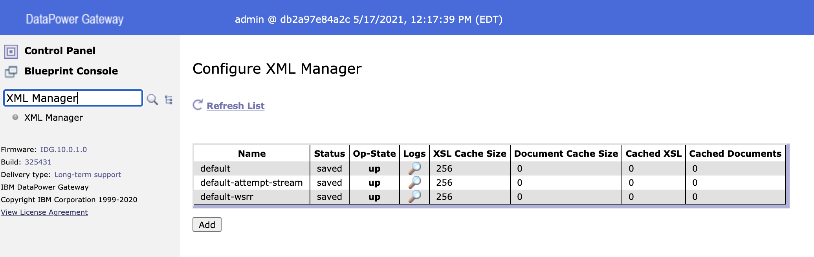 

2. Clique no botão *Add* e atribua um nome para ele
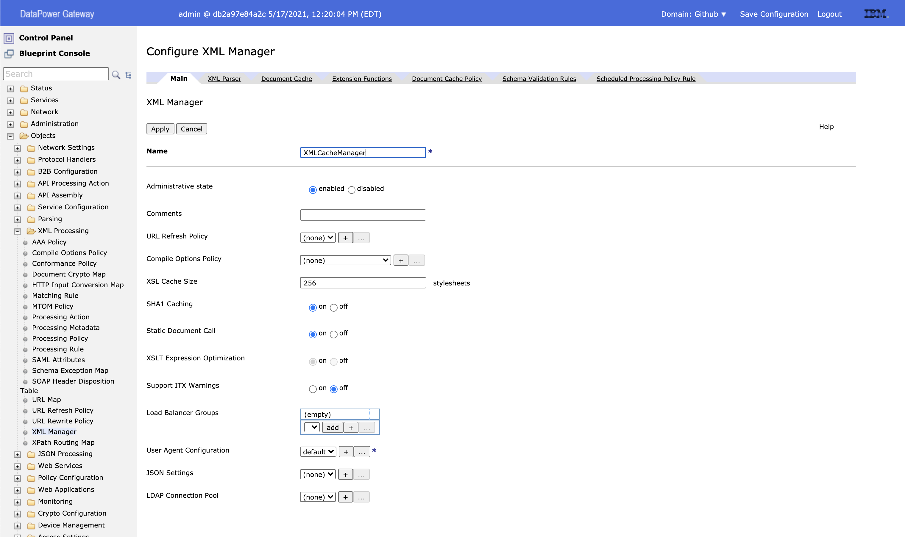 

3. Acesse a aba *Document Cache*, nesta aba possui 3 parâmetros importantes para o gerenciamento do cache:
 - **Document Cache Count:** Quantidade máxima de objetos que poderão ser armazenados no cache
 - **Document Cache Size:** Tamanho máximo dos objetos que serão armazenados no cache
 - **Maximum concurrent writes:** Número máximo de solicitações de gravação simultâneas para criar documentos ou atualizar documentos expirados no cache de documentos

 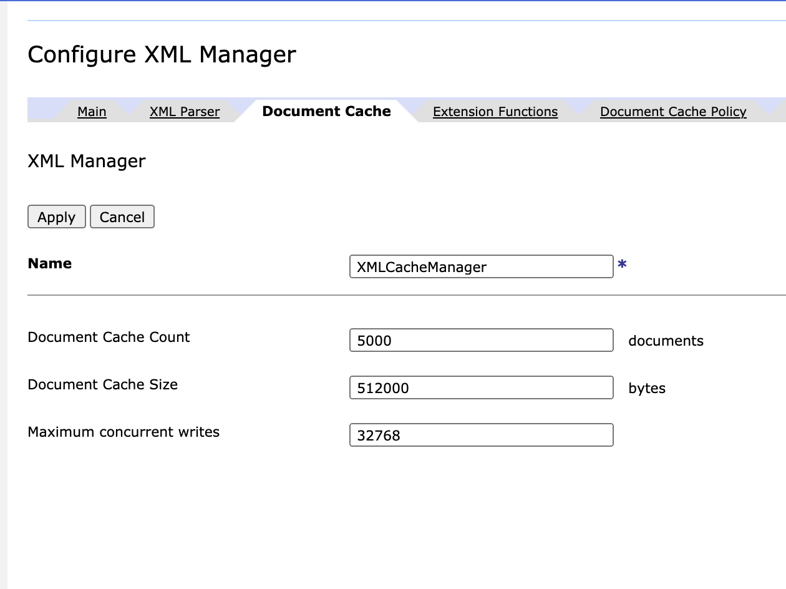 

 4. Acesse a aba *Document Cache Policy*, nesta aba possui as principais configurações para definições do nosso cache.

 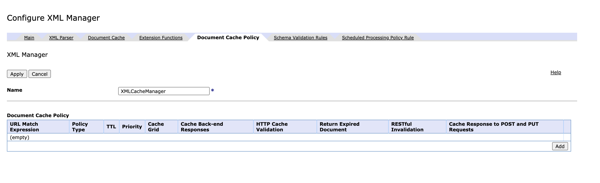 

Clique no botão *Add*

5. Nesta seção iremos fazer a configuração do cache:
    - **URL Match Expression:** Definição do contexto que o cache será ativado
    - **Policy Type:** A política que para o nosso cenário será fixo.
    - **TTL:** Tempo de vida que a informação terá, depois que a expiração ocorrer esta informação será removida do cache.
    - **Priority:** Caso queira definir prioridades para objetos em cache
    - **Cache Grid:** Será utilizado para criar um Grid no WXS(será configurado mais a frente).
    - **Cache Back-end Responses:** Esta opção deve ser habilitada para ativar o cache de resposta do backend.
    - **HTTP Cache Validation:** Está opção quando ativada, faz uma validação no backend para verificar se o objeto em cache foi atualizado.
    - **Return Expired Document:** Está opção quando ativada, irá retornar um objeto mesmo expirado, isso é importante em um cenário de quando o backend não estiver mais disponível.
    - **Cache Response to POST and PUT Requests:** Está opção deve ser habilitada quando você deseja armazenar em cache solicitações recebidas pelos métodos PUT/POST.

     

    6. Por fim, associe o XML Manager criado à um fluxo.

--- 

## Criação de cache externo(WXS)
 

### Para utilizar uma grid como cache no Datapower deverá ser executado todos os passos para criação de um cache interno e depois será feito a inclusão do grid no cache.

### Etapas:
 - Criação de um Load Balancer Group
 - Criação do eXtreme Scale Grid 

## Criação de um Load Balancer Group
### Para iniciar a utilização do grid, iremos criar um Load Balancer Group para incluir todos os servidores do grid(caso tenha mais de um), para criar um Load Balancer group utilize o artigo: [Criando Load Balancer Group](https://github.com/dbatista/datapower/blob/main/Criando%20Load%20Balancer%20Group/CriandoLoadBalancer.md)

## Criação do eXtreme Scale Grid 
1. Acesse a funcionalidade **eXtreme Scale Grid** e clique no botão *Add* 
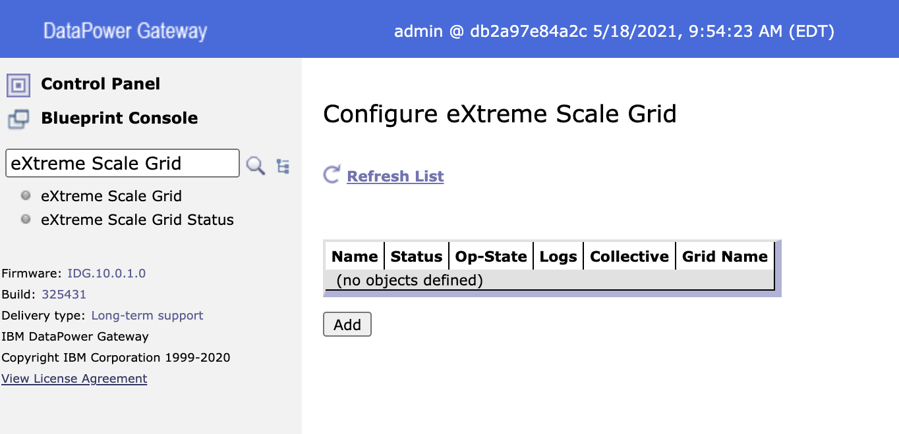 

2. Na configuração do eXtreme Scale atribua um nome para o serviço e defina os seguintes atributos:
    - **Collective:** Nome do Load Balancer Group criado.
    - **Grid Name:** Nome do grid criado no eXtreme Scale
    - **User:** Usuário definido para login no eXtreme Scale
    - **Password Alias:** Usuário definida para login no eXtreme Scale
    - **TLS client profile:** Chave pública do serviço eXtreme Scale
    - **Encrypted Data:** Chave simétrica utilizada para criptografia dos dados que ficarão armazenados no cache
    - **Hash Key Obfuscation:** Marque esta opção para ofuscar as chaves que serão utilizadas pelo eXtreme Scale
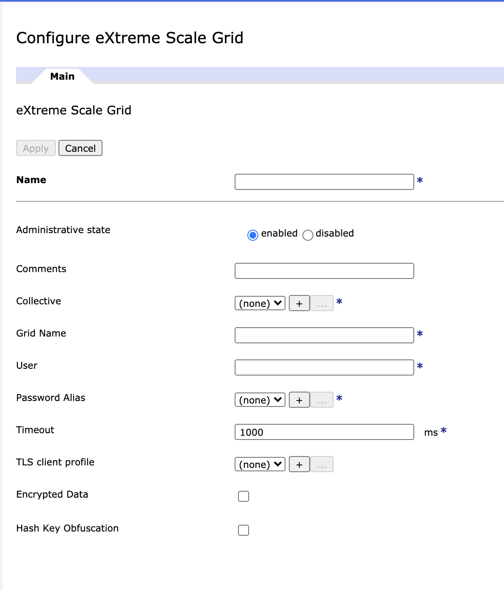 
---

## Execução

### Para testar o fluxo será utilizado o Postman, com ele iremos fazer uma chamada para a url do Datapower com o contexto **/cache** que definimos na aba **Document Cache policy** além disso passando o parâmetro  header*x-dp-cache-key* no header, ele é quem irá processar realizar o index do cache.
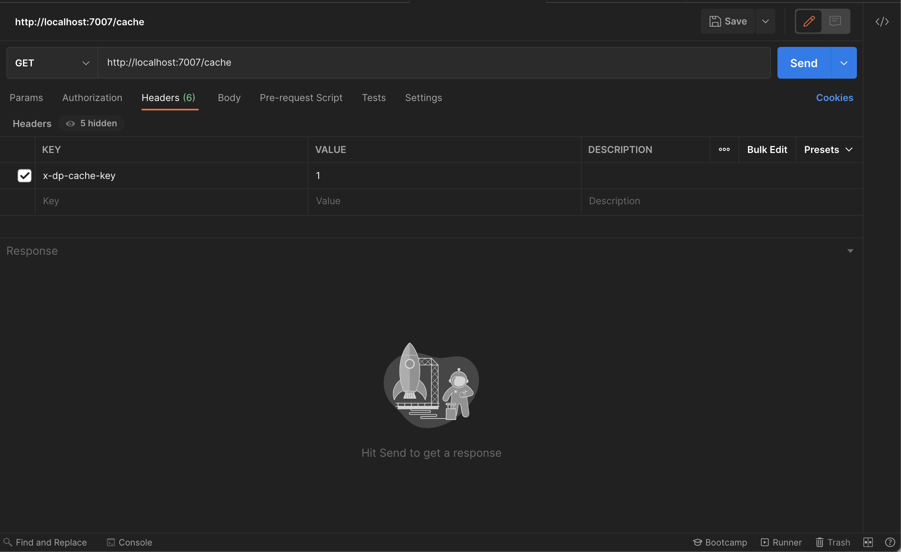 

### Ao executar a primeira chamada, ele irá até o backend, da segunda chamada em diante ele irá para o cache e irá incluir um parâmetro novo no *Header* de response com o nome de **Age**

### **Primeira chamada:**
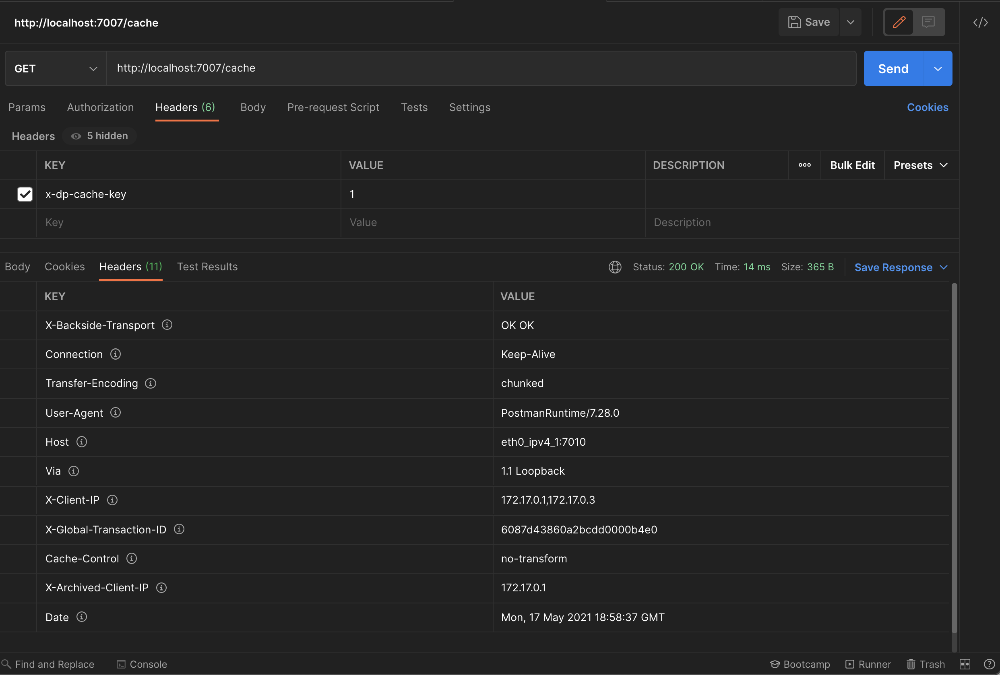 

### **Segunda chamada:**
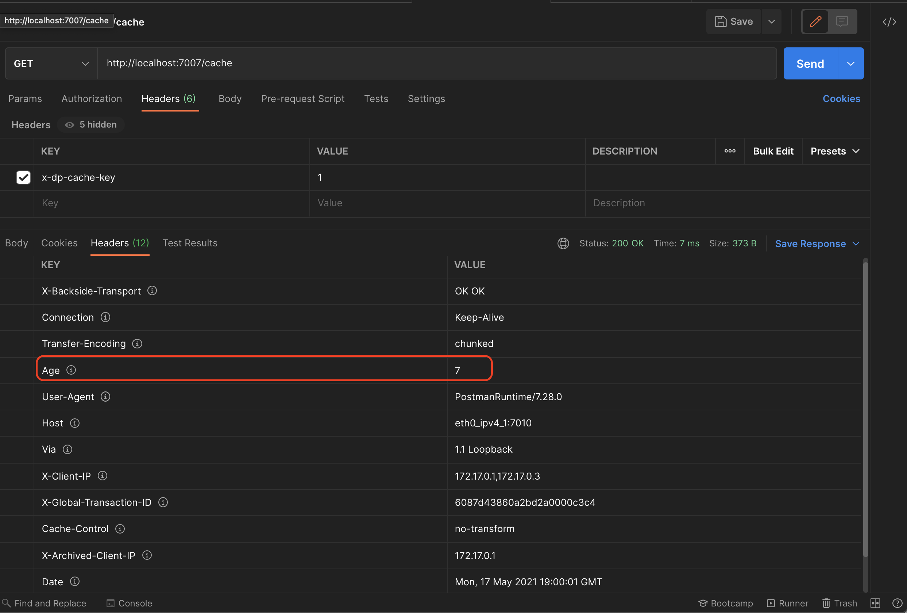 

### O parâmetro **Age**, retorna a quantidade em segundos de quanto tempo o objeto está em memória.

---

## Passando o x-dp-cache-key

### Quando você precisa fazer com que um serviço do Datapower chame outro serviço passando o parâmetro x-dp-cache-key no header será necessário se atentar para alguns requisitos, **o Datapower não permite que você injete header o parâmetro x-dp-cache-key entre um fluxo e outro**, portanto o que você deve fazer:

1. **Criar um novo parâmetro, x-cache-key por exemplo**

2. **No fluxo que irá gerenciar o cache, caso no request, tenha o novo parâmetro ele header o parâmetro correto: x-dp-cache-key, isso na regra de client-to-server**
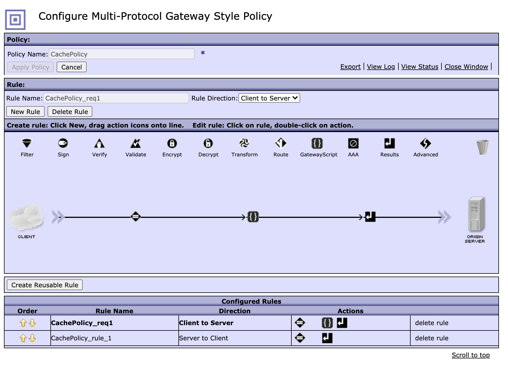 
```
var hm = require('header-metadata');
var cacheId = hm.current.get('x-cache-key');
if(cacheId){
    hm.current.set('x-dp-cache-key', cacheId);    
}
```

3. **No fluxo cliente, que irá chamar o MPGW responsável por cache, você deverá incluir no header o parâmetro: x-cache-key**
```
<xsl:stylesheet version="1.0"
xmlns:xsl="http://www.w3.org/1999/XSL/Transform"
xmlns:dp="http://www.datapower.com/extensions"
extension-element-prefixes="dp"
exclude-result-prefixes="dp">
	
    <xsl:template match="/">
       
        <xsl:variable name="headerValues">
            <header name="x-cache-key">1</header>
        </xsl:variable>
        
        <xsl:variable name="result">
            <dp:url-open target="http://eth0_ipv4_1:7004/cache"  response="responsecode" http-headers="$headerValues" http-method="get"> 
            </dp:url-open>
        </xsl:variable>
        <age>
             <xsl:value-of select="$result/url-open/headers/header[@name='Age']"/>
        </age>
	</xsl:template>
</xsl:stylesheet>
```