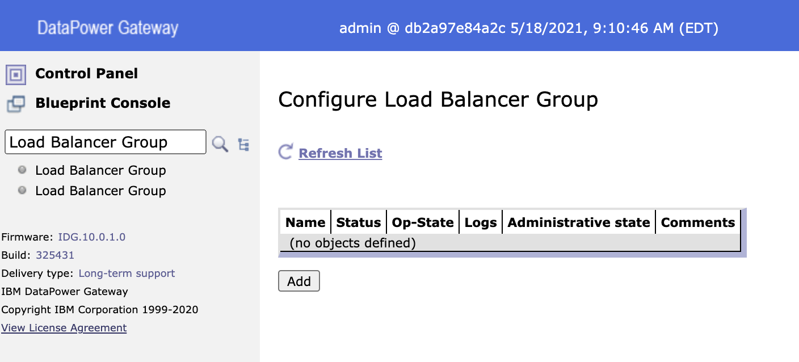
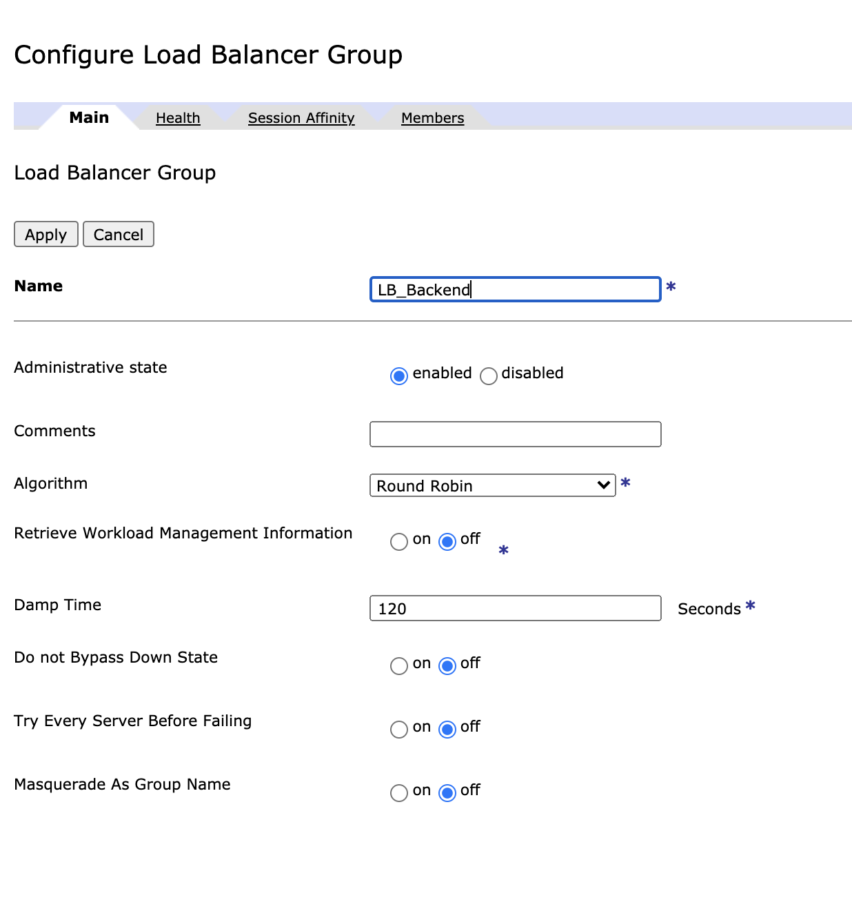
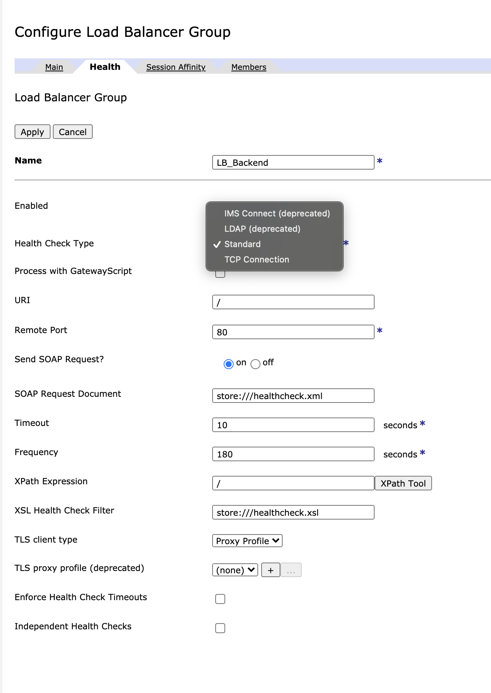
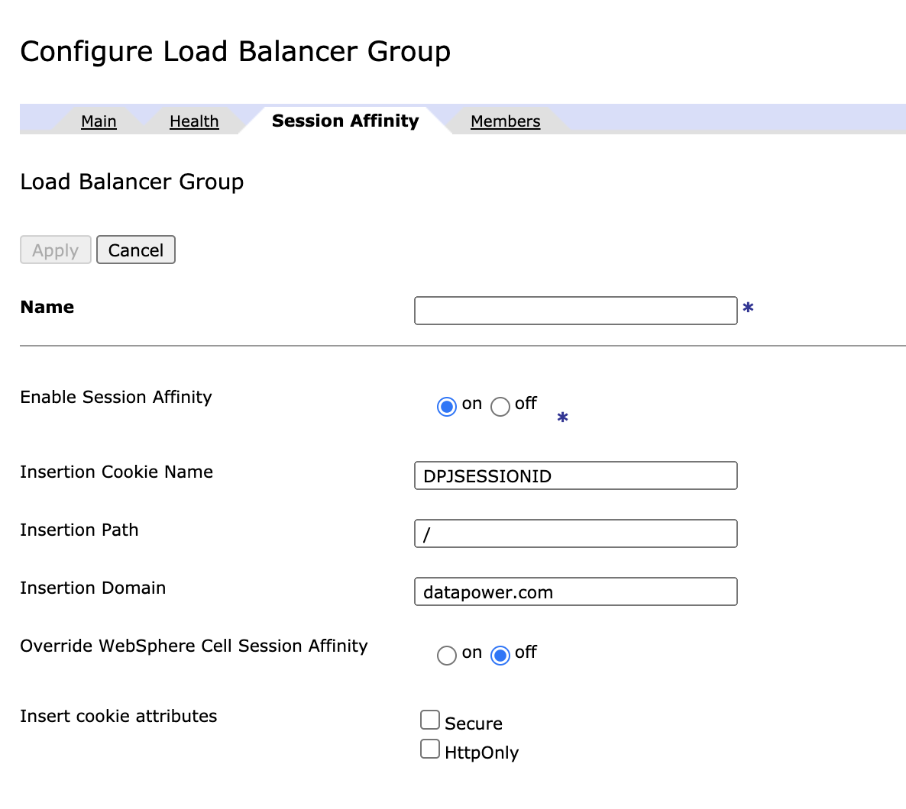
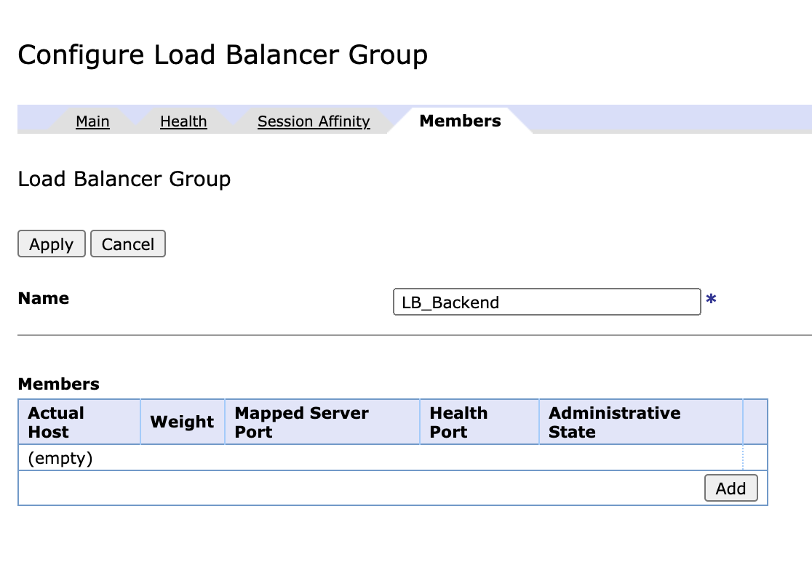
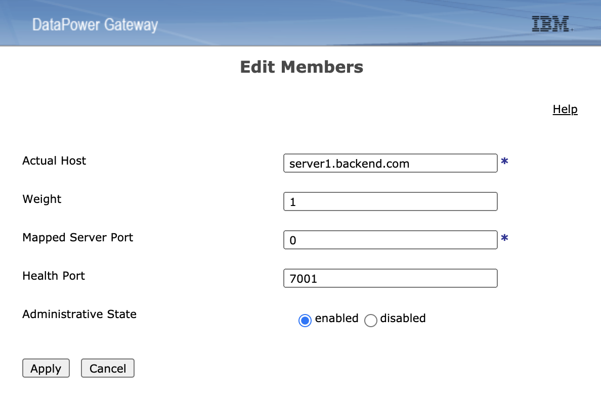
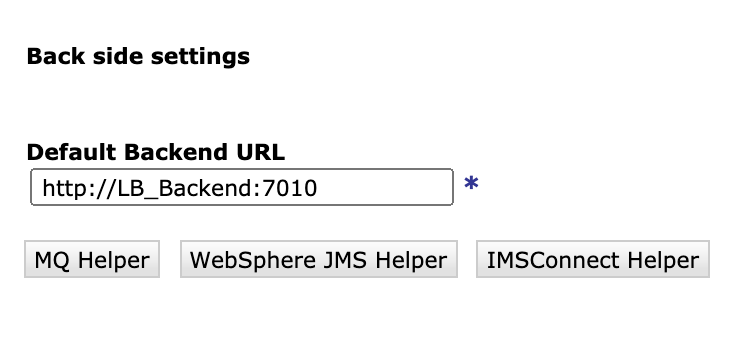

# Como criar um Load Balancer group

## Introdução 

### O Load Balancer Group é um recurso no IBM Datapower Gateways que permite fazer um balanceamento entre mais de um serviço, utilizando vários protocolos.

---

## Etapas 

### Para criar um Load Balancer você deve ter:

1. **Os hostnames dos servidores de destino**
2. **Uma porta para HealthCheck**

---

## Procedimentos

1. Acesse a configuração do Load Balancer Group 
 

2. Clique no botão *Add* e na Aba *Main* atribua um nome, que será utilizado posteriormente para.
 

3. Acesse a aba *Health*, nesta aba iremos fazer o setup para verificar se os nodes que estão no Load Balancer estarão ativos, os dois principais tipos são: 
    - **Standard:** Utilizado quando você precisa fazer uma chamada para um serviço do node e analisar a resposta dele, inclusive podendo fazer uma transação sintética.
    - **TCP Connection:** Utilizado quando você precisa apenas fazer uma consulta TCP para verificar se há conectividade entre o ip/porta. 
 

4. Acesse a aba *Session Affinity* para fazer o setup da afinidade de sessão caso o Load Balancer seja uma aplicação Web com gerenciamento de sessão.
 

5. Acesse a aba *Members* para definir os ips dos nodes que irão compor o Load Balancer e clique no botão *Add*.
 

Nesta etapa deve ser configurado para cada servidor que será utilizado no Load Balancer:
- **Actual Host:** O hostname do  servidor de destino
- **Weight:** Peso, caso um node tenha um peso maior que o outro, defina isso neste campo
- **Mapped Server Port:** Caso deseje configurar para uma porta especifica, utilize esse campo, utilize a porta 0(default) caso seja qualquer porta.
- **Health Port:** Utilize uma porta de Health caso para um node especifico a porta de Health seja diferente dos demais servidores.
 
---

## Utilização

### Para utilizar o Load Balancer, basta usar o seu nome, que o Datapower irá fazer o balanceamento entre os nodes.
 