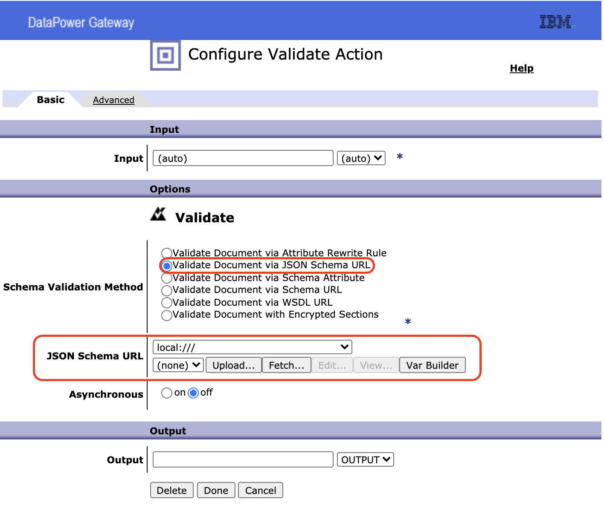

# Validação de JSON

### Assim como XML, é possível fazer uma validação no conteúdo da mensagem, para validar o JSON deve ser utilizado o  [JSON Schema](https://json-schema.org).

## Exemplo de JSON Schema: 
```
{
  "$id": "https://example.com/person.schema.json",
  "$schema": "http://json-schema.org/draft-07/schema#",
  "title": "Person",
  "type": "object",
  "properties": {
    "firstName": {
      "type": "string",
      "description": "The person's first name."
    },
    "lastName": {
      "type": "string",
      "description": "The person's last name."
    },
    "age": {
      "description": "Age in years which must be equal to or greater than zero.",
      "type": "integer",
      "minimum": 0
    }
  }
}
```

## Exemplo de JSON: 
```
{
  "firstName": "John",
  "lastName": "Doe",
  "age": 21
}
```

### O JSON Schema irá fazer a validação do JSON, portanto o que a gente precisa é ter apenas o JSON Schema no lado do Datapower para ele fazer as validações.

### Antes de começar a enviar o JSON Schema para o Datapower é importante validar se o JSON está de acordo com o JSON Schema, para isso existem ferramentas como Oxygen ou alguns sites.
---
## Incluir validação de JSON no fluxo
### Após verificar se o JSON Schema e o JSON estão de acordo, podemos incluí-los na regra do Datapower.

### Acesse o fluxo e adicione uma action de validation no fluxo
 

### Configure a validação com o JSON Schema gerado e salve o fluxo
 

### Com isso o fluxo agora possui uma validação baseada em JSON Schema contra JSON, caso seja enviado um JSON invalido, a msg de erro deverá ser um erro 500
 

### Caso a validação seja positiva, a requisição será enviada para a próxima action(caso tenha).
