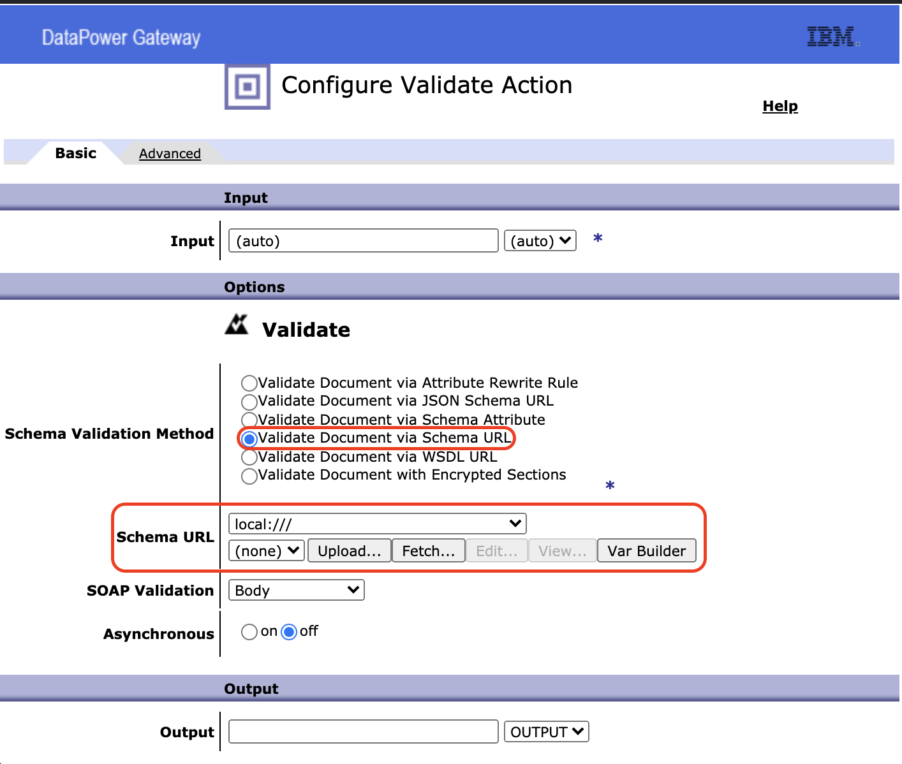

# Validação de XML

### Quando está expondo serviços que a troca de mensagens é feita via XML é importante ter uma validação dos objetos na entrada dos dados, isso evita que um XML invalido seja validado no backend, evitando um processamento desnecessário do serviço protegido pelo Datapower.

### Para fazer essa validação de XML é necessário ter um XSD, com ele é possível validar se a mensagem está de acordo com um padrão previamente definido entre o cliente e o serviço exposto.


## Exemplo de XSD: 
```
<?xml version="1.0" encoding="UTF-8" ?>
<xs:schema xmlns:xs="http://www.w3.org/2001/XMLSchema">

<xs:element name="shiporder">
  <xs:complexType>
    <xs:sequence>
      <xs:element name="orderperson" type="xs:string"/>
      <xs:element name="shipto">
        <xs:complexType>
          <xs:sequence>
            <xs:element name="name" type="xs:string"/>
            <xs:element name="address" type="xs:string"/>
            <xs:element name="city" type="xs:string"/>
            <xs:element name="country" type="xs:string"/>
          </xs:sequence>
        </xs:complexType>
      </xs:element>
      <xs:element name="item" maxOccurs="unbounded">
        <xs:complexType>
          <xs:sequence>
            <xs:element name="title" type="xs:string"/>
            <xs:element name="note" type="xs:string" minOccurs="0"/>
            <xs:element name="quantity" type="xs:positiveInteger"/>
            <xs:element name="price" type="xs:decimal"/>
          </xs:sequence>
        </xs:complexType>
      </xs:element>
    </xs:sequence>
    <xs:attribute name="orderid" type="xs:string" use="required"/>
  </xs:complexType>
</xs:element>

</xs:schema>
```
## Exemplo de XML: 
```
<?xml version="1.0" encoding="UTF-8"?>

<shiporder orderid="889923"
xmlns:xsi="http://www.w3.org/2001/XMLSchema-instance"
xsi:noNamespaceSchemaLocation="shiporder.xsd">
  <orderperson>John Smith</orderperson>
  <shipto>
    <name>Ola Nordmann</name>
    <address>Langgt 23</address>
    <city>4000 Stavanger</city>
    <country>Norway</country>
  </shipto>
  <item>
    <title>Empire Burlesque</title>
    <note>Special Edition</note>
    <quantity>1</quantity>
    <price>10.90</price>
  </item>
  <item>
    <title>Hide your heart</title>
    <quantity>1</quantity>
    <price>9.90</price>
  </item>
</shiporder>
```
### O XSD irá fazer a validação do XML, portanto o que a gente precisa é ter apenas o XSD no lado do Datapower para ele fazer as validações.

### Antes de começar a enviar o XSD para o Datapower é importante validar se o XML está de acordo com o XSD, para isso existem ferramentas como Oxygen ou alguns sites.
---
## Incluir validação de XML no fluxo
### Após verificar se o XSD e o XML estão de acordo, podemos incluí-los na regra do Datapower.

### Acesse o fluxo e adicione uma action de validation no fluxo
 

### Configure a validação com o XSD gerado e salve o fluxo
 

### Com isso o fluxo agora possui uma validação baseada em XSD contra XML, caso seja enviado um XML invalido, a msg de erro deverá ser um erro 500
 

### Caso a validação seja positiva, a requisição será enviada para a próxima action(caso tenha).
