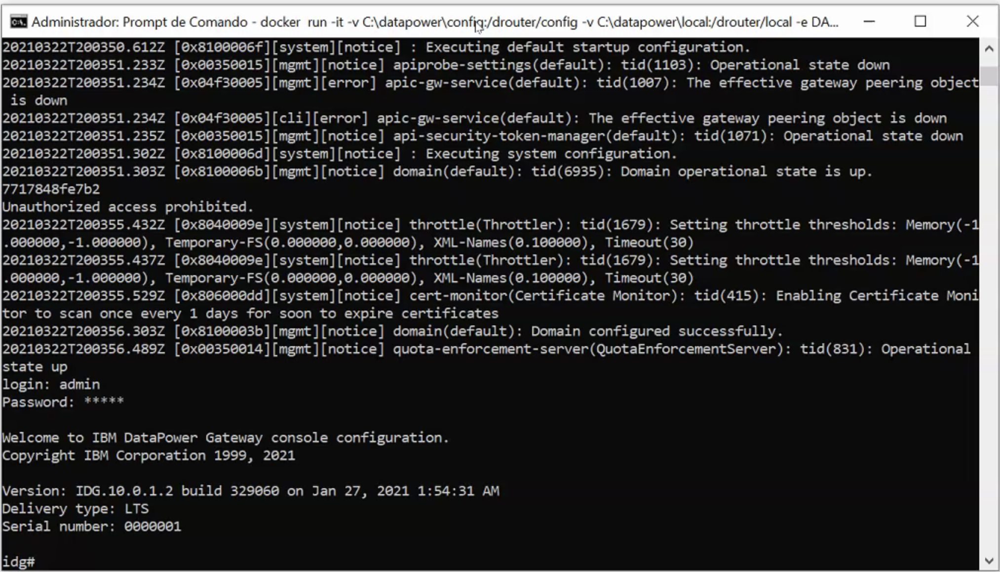
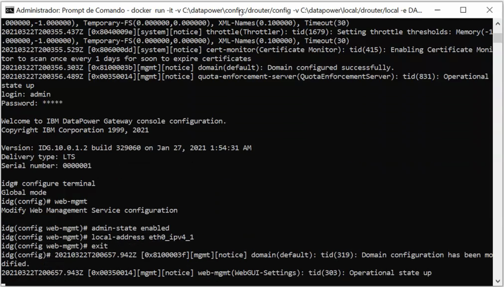
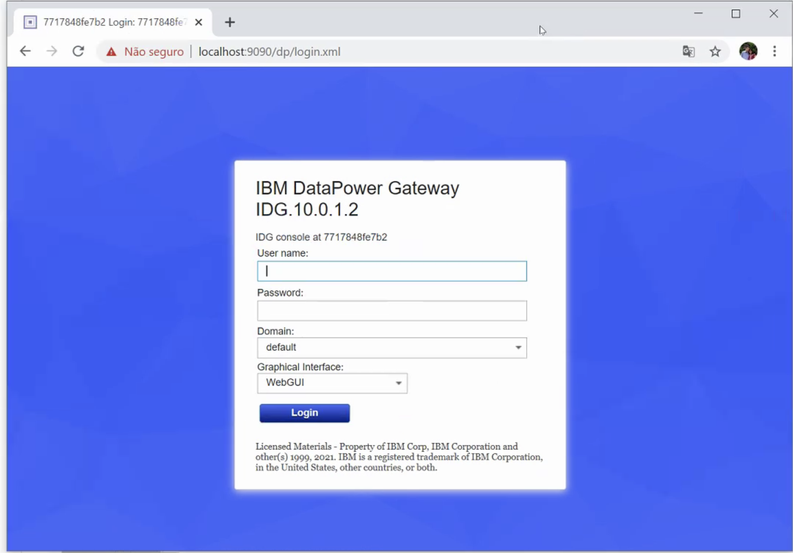

# Como executar Datapower no Windows

### Datapower pode ser entregue em diferentes formatos: Física, VMware, Linux, Cloud(pública ou privada) e Docker, este artigo irá tratar como como utilizar o Datapower deste último formato, iremos utilizar a imagem do datapower disponível em: https://hub.docker.com/r/ibmcom/datapower/.

### Esta imagem possui licenciamento apenas para desenvolvimento portanto, não pode ser levada para produção.

### Para executar o Datapower on Docker é necessário ter:

- Docker instalado e configurado
- Ter 4gb de memória RAM
- 2 CPUs

#### Como iniciar o Datapower, caso não tenha uma imagem do Datapower localmente, ele irá baixar.
```
docker run -it -v C:\datapower\config:/drouter/config -v C:\datapower\local:/drouter/local -e DATAPOWER_ACCEPT_LICENSE=true -e DATAPOWER_INTERACTIVE=true -p 9090:9090 -p 9022:22 -p 5554:5554 -p 7000-7030:7000-7030 --name idg ibmcom/datapower
```

#### Com isso, ele irá subir uma imagem nova, liberando 30 portas para uso, da 7000 até a 7030, que pode ser utilizadas para o HTTP Handlers por exemplo.


#### Acesse o console com o usuário/senha admin/admin e inicie o console web 
 

#### Configure o Console web com os comandos abaixo
 
````
configure terminal
web-mgmt
admin-state enabled
local-address eth0_ipv4_1 "9090"
exit
write mem
````
#### Acesse a url: https://localhost:9090
 