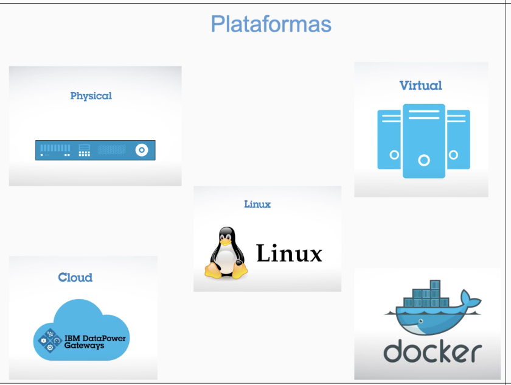
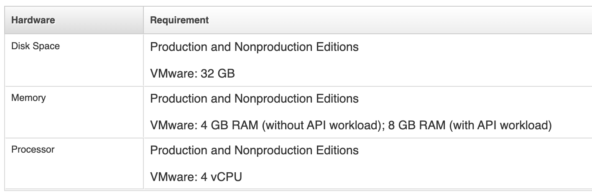

# Datapower on VMWare

 

# Introdução

### O IBM Datapower Gateway pode ser entregue em diferentes formatos: Física, VMware, Linux, Cloud(pública ou privada) e Docker, este artigo irá tratar como como utilizar o Datapower virtual sendo executado em um ambiente VMWare.

### **Destas versões, apenas a versão On Docker é fornecida de forma gratuita, as demais precisam ser licenciadas.**

### Existem 2 versões de IBM Datapower Gateway on VMWare, uma para ser executada em ambientes de execução, como Desenvolvimento, Homologação e outra para ser executada somente para desenvolvimento de fluxos.
---

### Para fazer o download das imagens, será necessário ter acesso ao [IBM Passport Advantage](https://www.ibm.com/software/passportadvantage/pao_customer.html).

- IBM DataPower Gateway for VMware Developers Edition V10.0.2 continuous delivery
   - Part number: **CJ93NEN**

- BM DataPower Gateway for VMware Nonproduction Edition V10.0.2 continuous delivery
   - Part number: **CJ93MEN**
---

# Requisitos
 

### Esses são os requisitos mínimos para execução do IBM Datapower Gateway
---

# Instalação

### Para gerar um ambiente será necessário ter feito o download da imagem no [IBM Passport Advantage](https://www.ibm.com/software/passportadvantage/pao_customer.html), após o download do arquivo ***OVA*** será necessário importa-lo no VMWare.

[Assistir vídeo de instalação](https://idg.s3.us.cloud-object-storage.appdomain.cloud/setupInicialDP.mov).

<video style="width:100%" controls>
  <source src="https://idg.s3.us.cloud-object-storage.appdomain.cloud/setupInicialDP.mov" type="video/mp4">
   Your browser does not support the video tag.
</video>